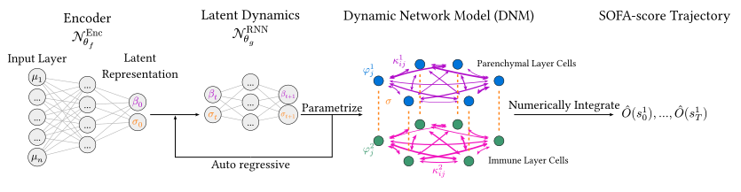
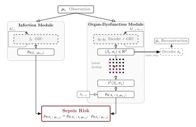

# Combining Machine-Learning and Dynamic Network Models to Improve Sepsis Predictiong

This repository houses both a replica implementation of the Dynamic Network Model (DNM) - a functional model of the sepsis disease, described in [Berner et al.](https://www.frontiersin.org/journals/network-physiology/articles/10.3389/fnetp.2021.730385/full) and [Sawicki et al.](https://www.frontiersin.org/journals/network-physiology/articles/10.3389/fnetp.2022.904480/full) as well as the Latent Dynamics Model (LDM), the main subject of my [thesis](main_thesis.pdf).


### DNM (Renamed to Physical Network Model in the Paper)



The DNM can be simulated using [JAX](https://github.com/google/jax) and [diffrax](https://github.com/patrick-kidger/diffrax), allowing for (GPU or CPU) accelerated numerical integration ([code](src/sepsis_osc/dnm)).

### LDM



The LDM is a Deep-Learning pipeline, built on top of [equinox](https://github.com/patrick-kidger/equinox), embedding the DNM parameter-space to generate interpretable patient trajectories and enable online sepsis prediction ([code](src/sepsis_osc/ldm)).

The [viz_*.py](src/sepsis_osc/visualisations) files can be used to visualize ensemble systems or single instances of the DNM initial value problems, LDM predictions.
Some visualization (like the parameter space) need the SystemMetrics to be saved via the storage interface beforehand (see `__main__` of the [dynamic_network_model.py](src/sepsis_osc/dnm/dynamic_network_model.py)).
One exemplary storage is provided with the name "DaisyFinal" storing two spaces (beta (0, 1, 0.01) and sigma (0, 1.5, 0.015) and beta (0.4, 0.7, 0.003) and sigma (0, 1.5, 0.015)).

All further visualizations and statistics can be generated using the notebooks in [misc/](misc)


## Project structure
```
sepsis_osc/
├── data/             # input / experimental datasets
├── figures/          # stored visualizations
├── misc/             # cohort creation and stats / visualization notebooks
├── src/
│   └── sepsis_osc/
│       ├── dnm/      # Dynamic Network Model
│       ├── ldm/      # Latent Dynamics Model
│       ├── utils/    # utilities and config
│       └── viz/      # visualization functions
└── typst/            # typst docs & drafts
    ├── figures/      # typst + cetz figures
    ├── images/       # svgs and pngs
    └── chapters/     # actual text
```


## Running the code

### DNM
First and foremost, install the `requirements.txt` via:
```
$ pip install -r requirements.txt
```

If you want persist simulation results, ensure you have [rocksdb](https://github.com/facebook/rocksdb) installed.
This is used together with [FAISS](https://github.com/facebookresearch/faiss) as a storage system for: *deduplication* (skip simulations for parameter sets already computed) and *checkpointing* (persist results as you go, so a parameter sweep can be interrupted and resumed without losing progress).


To simulate: either install `seps_osc` as a module and run:
```
$ pip install -e .
$ python -m sepsis_osc.dnm.dynamic_network_model
```
or by specifying the `PYTHONPATH`:
```
$ PYTHONPATH=. python src/sepsis_osc/dnm/dynamic_network_model.py
```

Training the LDM requires additional packages (specifically [YAIB](https://github.com/rvandewater/YAIB)), together with the [MIMIC-IV](https://physionet.org/content/mimiciv/)-database being correctly set up.
It is recommended to use the YAIB docker container.
Afterwards, the cohort can be generated by running the [misc/yaib_cohort_script.py](misc/custom_sepsis_yaib_cohort.py).
Make sure the `yaib_data_dir` in 'src/sepsis_osc/utils/config.py' pointing to the correct location.

After successfull setup, the LDM can be trained via:
```
$ python -m sepsis_osc.ldm.train_online
```
if `sepsis_osc` has been installed as module, or:
```
$ PYTHONPATH=. python src/sepsis_osc/ldm/train_online.py
```
otherwise.

Since the YAIB is using a Pytorch-Dataset, but we are utilizing JAX, the processed dataset will be saved as a JAX Array to the `data` directory, see ([data_loading.py](src/sepsis_osc/ldm/data_loading.py)).


